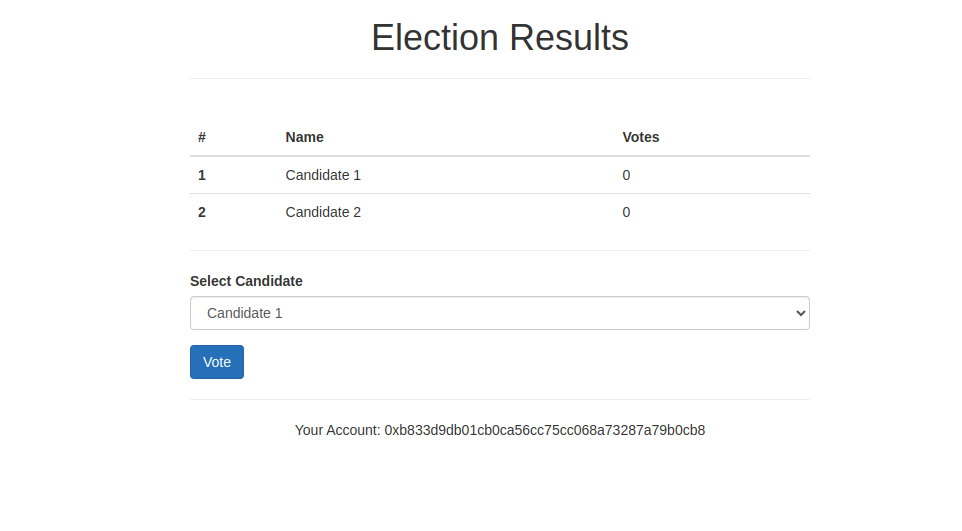
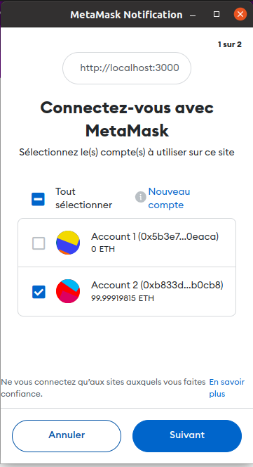
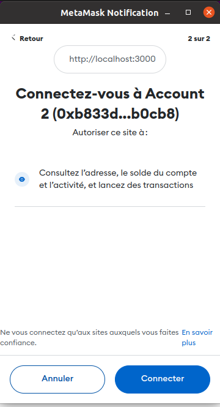
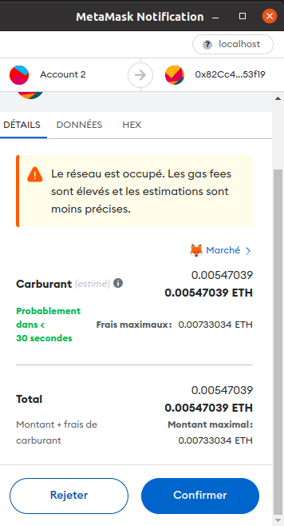
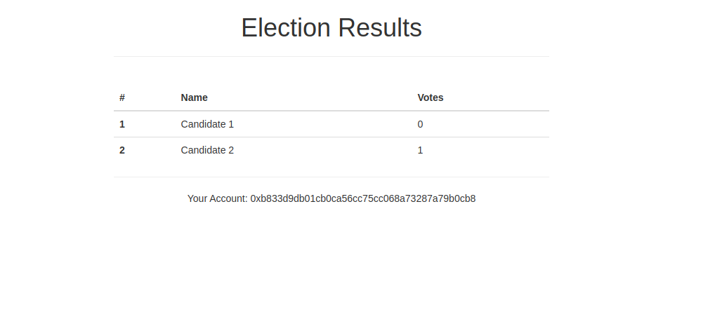

# eVoting App Using Blockchain

## Overview
This eVoting application leverages blockchain technology to ensure a secure, transparent, and tamper-proof voting process. It's designed for local testing using Ganache as the personal blockchain and MetaMask as the Ethereum wallet.

## Prerequisites
- Ganache - Download and install from [Truffle Suite](https://www.trufflesuite.com/ganache)
- MetaMask - Install as a browser extension from [MetaMask](https://metamask.io/)
- Node.js - Download and install from [Node.js](https://nodejs.org/)

## Installation and Setup
1. Clone the repository:
   ```
   git clone https://github.com/ahmedmahfoudhi/e-voting.git
   ```
2. Navigate to the project directory and install dependencies:
   ```
   cd e-voting
   npm install
   ```
3. Start Ganache and create a personal blockchain.

4. Connect MetaMask to your local Ganache blockchain.

5. Compile and deploy the smart contract:
   ```
   truffle compile
   truffle migrate
   ```

6. Start the local development server:
   ```
   npm run dev
   ```
   

## Voting Process

### Connecting to the Blockchain
1. Open the eVoting application in your web browser.
2. Connect MetaMask to the app when prompted.

   
   

### Choosing a Candidate
1. The list of candidates will be displayed on the application's main page.
2. Browse through the candidates to make your choice.

### Casting Your Vote
1. Select your preferred candidate from the list.
2. Click the 'Vote' button to cast your vote.
3. Confirm the transaction in MetaMask.

   

### Viewing Voting Results
1. After voting, the application will update to show the current voting results.
2. You can see how many votes each candidate has received.

   

## Testing
To run tests on the smart contracts:
```
truffle test
```